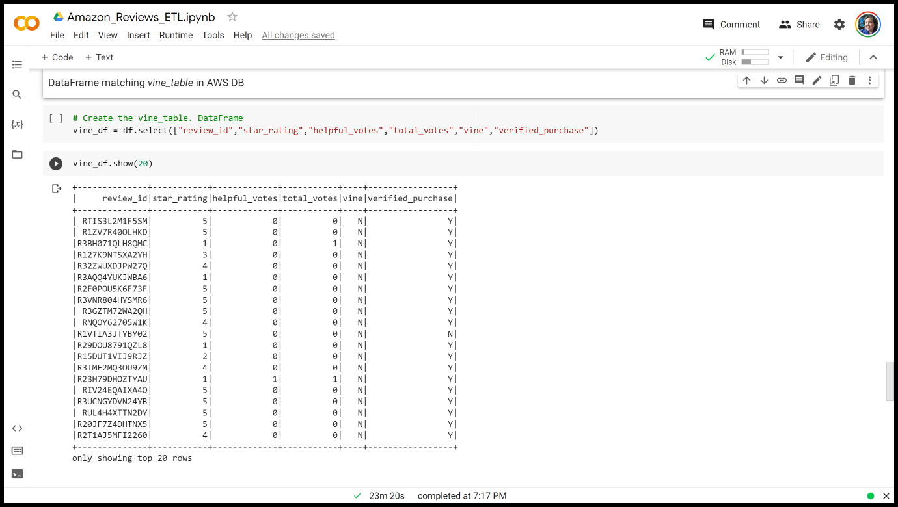
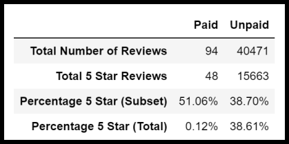

# Amazon_Vine_Analysis
<!-- Analysis of review bias by Amazon Vine users using PySpark, Jupyter Notebook / Google Colab -->
## Project Background
The client SellBy participates in Amazon's Vine Program[^1], which is an invite-only group of buyers (Vine Voices) that receive free products from companies like SellBy in exchange for impartial reviews.  SellyBy has access to approximately 50 datasets of Amazon Reviews, and has requested an assessment of any review bias any single one of these datasets.  

[^1]: "About Amazon Vine". [https://sellercentral.amazon.com/help/hub/reference/external/92T8UV339NZ98TN?ld=SDUSSOADirect](https://sellercentral.amazon.com/help/hub/reference/external/92T8UV339NZ98TN?ld=SDUSSOADirect).

## Purpose
The purpose of this project is to determine if there is any bias toward favorable reviews from Vine members in the Amazon Video Games dataset.

## Resources
### Data Sources & Bespoke Code
1. [Amazon Video Game Reviews](https://s3.amazonaws.com/amazon-reviews-pds/tsv/amazon_reviews_us_Video_Games_v1_00.tsv.gz) [^2]
2. [Amazon_Reviews_ETL.ipynb](Amazon_Reviews_ETL.ipynb) [^3]
3. [Vine_Review_Analysis.ipynb](Vine_Review_Analysis.ipynb) [^4]
4. [vine_table.csv](Data/vine_table.csv)

[^2]: "Amazon Review Data Sets". [https://s3.amazonaws.com/amazon-reviews-pds/tsv/index.txt](https://s3.amazonaws.com/amazon-reviews-pds/tsv/index.txt).  
[^3]: Google CoLab Notebook
[^4]: Jupyter Notebook

### Software & CDNs
***Table 1: Software & Library Versions***
| Software | Version |
| :--- | :---: |
| pgAdmin | 6.8 |
| PostgreSQL | 11.16 |
| PostgreSQL JDBC | 4.2 / 42.2.16 |
| Python | 3.7.13 |
| numpy | 1.21.5 |
| pandas | 1.3.5 |
| Spark | 3.3.0 |
| Visual Studio Code | 1.70.2 |

# Results 
## Methodology
An ETL of review data for Amazon Video Games was performed using the Google CoLab code [Amazon_Reviews_ETL.ipynb](Amazon_Reviews_ETL.ipynb), uploading the cleaned data to an AWS PostgreSQL database.  The table *vine_table* was exported as a *.csv* file, and preliminary statistics were analyzed using the Jupyter Notebook code [Vine_Review_Analysis.ipynb](Vine_Review_Analysis.ipynb).

For the Vine Review analysis, the most useful Amazon Video Games reviews were filtered by:
- At least 20 total votes (65379 of 1785997 total reviews)
- At least 50% of votes were classified as helpful (40565 of 65379 reviews)

View Screenshot of vine_table ETL

  

  
  

View Screenshot of vine_table filtering

  

  
  

## Paid vs. Unpaid Reviews
Analysis of the filtered Amazon Video Games reviews showed:

***Table 2: Amazon Video Games Vine Review Statistics***

From ***Table 2***, it can be concluded:
- There are significantly more non-Vine reviews than Vine reviews, with Vine reviews only making up about 0.23% of the most useful Amazon Video Games reviews.
- 51.06% of the 94 Vine reviews were 5 stars, in comparison to 38.70% of the 40471 non-Vine reviews.

# Summary 
<!-- In your summary, state if there is any positivity bias for reviews in the Vine program. Use the results of your analysis to support your statement. Then, provide one additional analysis that you could do with the dataset to support your statement. -->
The paid Vine reviews do have a higher percentage of 5-star reviews than the unpaid reviews (51.05% vs. 38.70%), which may indicate a positive bias.  However, there is a huge disparity between sample sizes (94 vs. 40471) that may skew the extent of any bias, with out going into further details on whether patterns in the Amazon Video Games reviews are indicitive of the Vine program as a whole.  Additionally, the skew in the data may be more influenced by other factors, such when the review was posted or game versions.  Further statistical analysis is recommended (e.g. logistic regression) to isolate if there is a valid relationship. 
